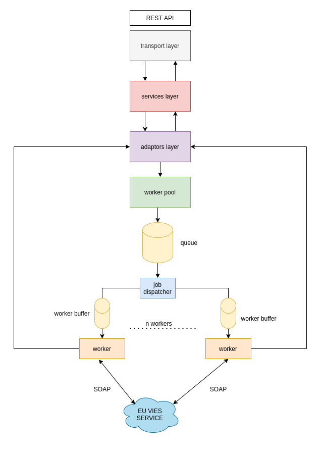
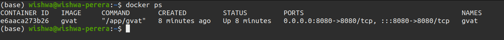

# GVAT
German vat id validator

[](https://github.com/wishperera/GVAT/actions/workflows/github-actions.yml)
### Introduction

GVAT is a REST service for validating the German VAT ID numbers against the EU/VIES online database. These can be
found in `.env` file in the project root.


#### Configuration

all application configurations are provided as environment variables. 


| Variable             | Description                            | Default |
|----------------------|----------------------------------------|---------|
| SERVER_PORT          | Server port                            | 8080    |
| EU_VIES_BASE_URL     | eu/vies service base url               | none    |
| EU_VIES_TIMEOUT      | eu/vies service call timeout (ms)      | 5000    |
| EU_VIES_MAX_RETRIES  | maximum number of retries per call     | 2       |
| POOL_MAX_WORKERS     | concurrenct number of eu/vies calls    | 10      |
| POOL_QUEUE_SIZE      | buffer size for eu/vies requests       | 1000    |
| POOL_WORKER_BUFFER   | worker buffer size for eu/vies calls   | 10      |
| SERVER_READ_TIMEOUT  | server read timeout milli (ms)         | 10000   |
| SERVER_WRITE_TIMEOUT | server write timeout milli (ms)        | 10000   |
### How to build and run

#### Using go build

###### On Linux

- make sure go 1.17.1 or above is installed
- clone the repository using git

```shell
git clone https://github.com/wishperera/GVAT.git
```
- enter the root directory and run the following command.
```shell
cd GVAT
sh cmd/build_and_run.sh
```

###### On other operating systems

- make sure go 1.17.1 or above is installed
- clone the repository using git
- set the `GOOS` and `GOARCH` env variables
- edit `.env` and source the env config to environment or manullay set them.

```shell
go build -o gvat
./gvat
```

#### Using docker

- make sure the latest version of docker is installed
- clone the repository using git

```shell
git clone https://github.com/wishperera/GVAT.git
```

- enable the docker containers to reach external networks as follows

```shell
sudo sysctl net.ipv4.conf.all.forwarding=1
sudo iptables -P FORWARD ACCEPT
```

- enter the root directory and run the following command. Edit the `.env` file if you need to change the configurations

```shell
cd GVAT
sh cmd/docker_build_and_run.sh
```

- verify the container is running

```shell
docker ps
```
- if everyting goes smooth  you should see something like below




### Verification of functionality

Use the following curl call to verify the functionality.

```shell
curl --location --request GET 'http://localhost:{PORT}/validate/DE129357125' \
--header 'trace-id: a27c776a-341e-11ec-8d3d-0242ac130000'
```
NOTE : replace the `{PORT}` field with the value you configured for `SERVICE_PORT`

default example:

```shell
curl --location --request GET 'http://localhost:8080/validate/{VAT_ID}' \
--header 'trace-id: a27c776a-341e-11ec-8d3d-0242ac130000'
```

NOTE : replace the `{VAT_ID}` with a valid vat id

if your VAT id is valid  you should receive a response similar to below

```json
{
    "vatId": "DE129357125",
    "valid": true
}
```

The full API reference can be found  [here](api-definition.yaml).


#### Room for improvement

- use exponential backoff while calling the eu/vies api
- integrate metrics